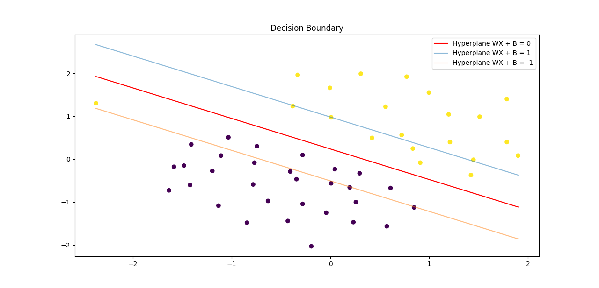
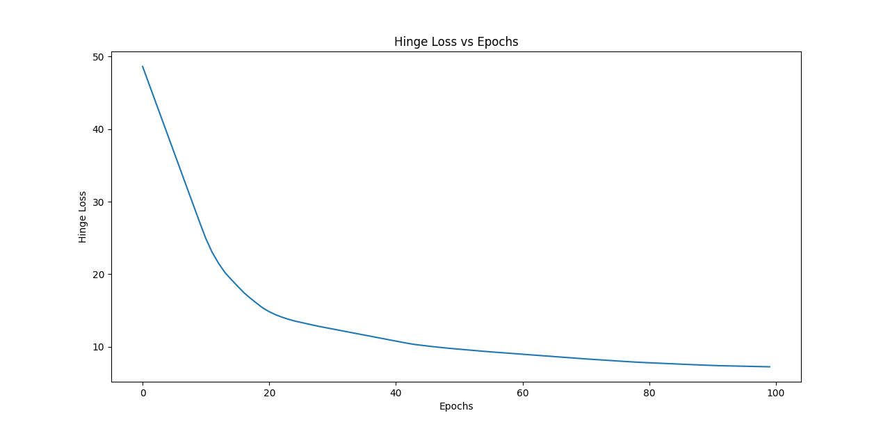
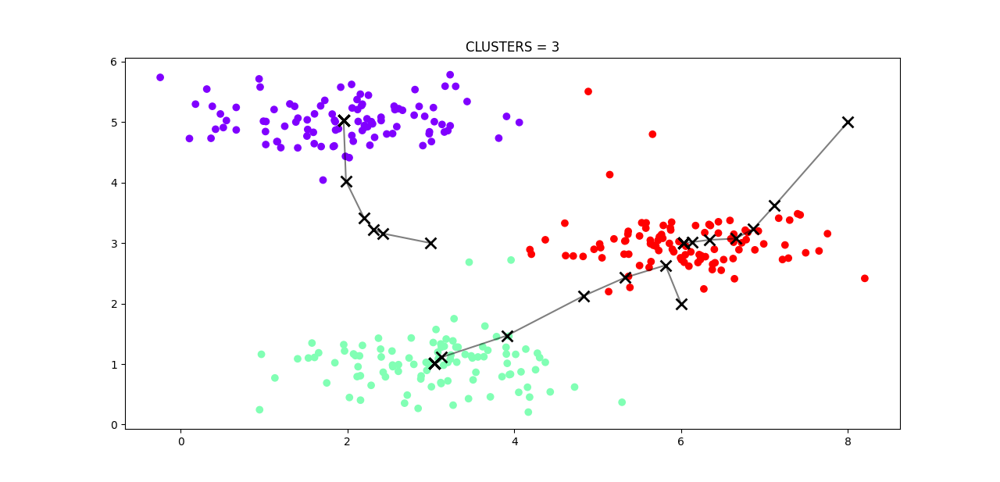
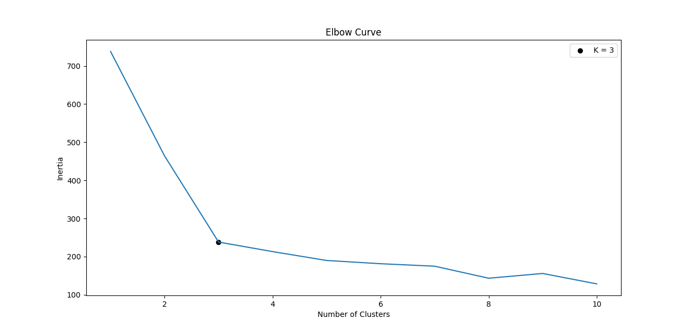

## Machine Learning Algorithms from Scratch

<table>
  <tr>
    <td colspan="2">Linear Regression</td>
  </tr>
  <tr>
    <td>
    	
	</td>
    <td>
    	
	</td>
  </tr>

  <tr>
    <td colspan="2">Logistic Regression</td>
  </tr>
  <tr>
    <td>
    	
	</td>
    <td>
    	
	</td>
  </tr>

  <tr>
    <td colspan="2">Support Vector Machine</td>
  </tr>
  <tr>
    <td>
      
  </td>
    <td>
      
  </td>
  </tr>

  <tr>
    <td colspan="2">Decision Tree</td>
  </tr>
  <tr>
    <td colspan="2">
      
    </td>
  </tr>

  <tr>
    <td colspan="2">K-Means</td>
  </tr>
  <tr>
    <td>
      
  </td>
    <td>
      
  </td>
  </tr>

</table>